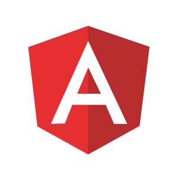

# 前端框架评估与分析

## 概述

这个话题其实有些宽泛，如今的前端框技术日新月异，各种框架层出不穷，令前端从业者在技术选型上眼花缭乱。在这里我也仅仅只谈谈自己的看法，如有不对，还望包涵。

## 是否需要使用框架

我想答案是肯定的。我们知道前端技术规范里有海量的API，浏览器也很难做到完全的兼容，对于主张手写Javascript的人（一般都是牛的不能行的大神），确实可以做到不用框架。但是，我认为这样会导致时间的浪费，不仅是个人的时间浪费，还会拉低团队的工作效率。在大多数情况下，由于团队成员水平不一，会给产品开发和维护带来更大的成本投入，而且这种行为也不利于团队发展，极易导致技能和经验无法的得到有效延续。

很显然，一些优秀的团队或组织在不断地为前端技术框架贡献着自己的力量，能让我们站在巨人的肩膀上更加专注于自己业务的实现。接下来，我主要介绍几个目前市面上比较流行的前端框架，以供大家甄选。

## Angular

### 优势

Angular的最大优势莫过于它的流行程度，可能是Goolgle的缘故吧。早在`Angular 1`推出之后，人们发现对于开发单页面 web 应用程序更加符合MVVM模式。通过对`Angular 1`进行现代化演变和重新构建框架的某些部分，以及一套用于构建用户界面的丰富组件，使得`Angular 2+`有了真正意义上的爆发了。

### 劣势

单页面应用程序如果没有提前对功能进行设计，容易导致整个项目难以维护。而且在实际项目中，运行时提供不属于核心框架的技术往往让人难以理解，这也极大的降低了`TypeScript`对最终开发者的价值。

### 何时选择

* 可以在一个大型的框架内获取技术资源，而且框架内的技术通常很容易移植；
* 你的应用能够很好的转化为标准的模型-视图模式
* 你对 Google Material UX 设计模式满意，那么 Material Angular 是遵循该模式的一种快速、简单且可靠的方式

需要注意的是 Angular1（angular.js）与 Angular2+ 是截然不同的，其中的应用、技术和经验不能直接移植到 Angular2+ 的开发中去。有理由相信在 Google 的持续支持下，Angular 会越来越成熟。

## React

### 优势

* 速度快：运用了Virtual Dom技术，Reactjs只在调用setState的时候会更新dom，而且还是先更新Virtual Dom，然后和实际Dom比较，最后再更新实际Dom。
* 兼容性好：Virtual DOM帮助我们解决了跨浏览器问题，它为我们提供了标准化的API，甚至在IE8中都是没问题的(0.x.x版本)。
* 组件化：代码更加模块化，重用代码更容易，可维护性高。
* 单向数据流：通常结合Redux进行状态管理，而Redux是JavaScript状态容器，提供可预测化的状态管理。
* 同构、纯粹的javascript：因为搜索引擎的爬虫程序依赖的是服务端响应而不是JavaScript的执行，预渲染你的应用有助于搜索引擎优化。
* 易于打包：比如使用RequireJS来加载和打包，而Browserify和Webpack适用于构建大型应用。它们使得那些艰难的任务不再让人望而生畏。

### 劣势

React本身并不是一个完整的框架，所以大型项目想要一套完整的框架的话，基本都需要加上ReactRouter和Redux才能写大型应用。要构建一个功能丰富的 Web 应用程序，你需要许多功能，一旦脱离 React 和 Redux 和其他一些库的核心，你将发现一个非常分散的社区，拥有无数的解决方案和模式，不容易整合在一起。

因此，虽然 React 和 Redux 都是非常专注的库，但缺乏经验的团队还是会很容易地生成不可维护的解决方案，而不是意识到他们所做的选择会导致性能不佳或错误。 即使有经验的开发人员也可能意识到，一个松散的架构或惯例可能会在未来困扰他们。

### 何时选择

* 如果你想构建一次编写，到处运行的程序，并且结合React Native实现Web和App双端展示，React是很好的选择
* 或者你很少需要手把手指导，并且正在寻找更好的库而不是全面的框架，那么React + Redux会给你很好的选择。

## Vue

### 优势

vue.js 最大的优势是渐进式构建能力，因为是一个构建数据驱动的 web 界面的渐进式框架。其目标是通过尽可能简单的 API 实现响应的数据绑定和组合的视图组件。核心是一个响应的数据绑定系统。

另外，它有一个强大且充满激情的社区，这也为其增加了巨大的价值，使得为一个空白项目创建一个综合的解决方案变得十分容易。

### 劣势

vue的社区问题比较突出，核心的开发基本落在个人（尤雨溪）身上，而其他的项目基本是由一个组织提供支持。

### 何时选择

* 如果你有一个传统的 web 应用程序，并需要一个强壮稳健的应用程序层，那么 vue.js 可能是一个很好的选择，它有清晰的模式，即使没有经验的团队也能正确或者错误的使用它。

## 写在最后

通过对Angular、React、Vue一些浅显的分析，在选择前端框架的时候更能找到适合自己或团队的方案。就我们团队而言，我们采用了React，除了上述的原因分析外，还有一个主要原因就是我们希望统一Web端和App端开发技术，这样能最大程度的提高团队开发效率。
