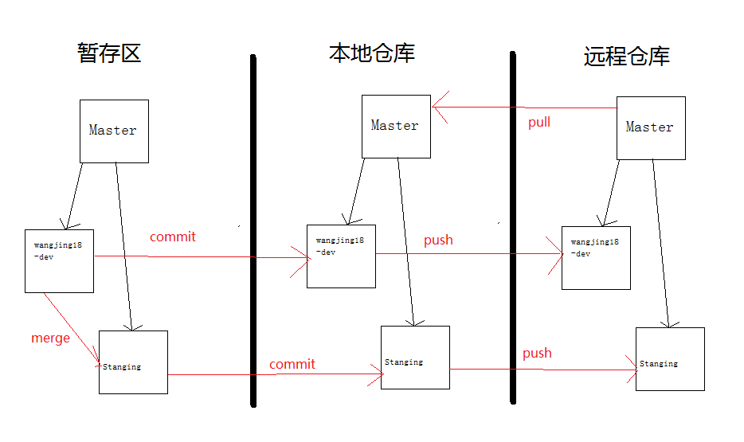

# 准备开发环境

前端开发早已不是html+jquery+css那么简单的套路，现在的前端开发朝着系统性、工程性方向迈进，在开发环境要求上也逐渐提高。为了适应这些新变化，前端开发人员也需要更多的学习和尝试。废话不多说了，现在给大家介绍如何搭建一套现代前端开发环境。

## VS Code


Visual Studio Code 是一个运行在桌面上，并且可用于Windows，Mac OS X和Linux平台的的轻量级且功能强大的源代码编辑器。它配备了内置的JavaScript的，TypeScript和Node.js的支持，并具有其他语言（C ++，C＃，Python和PHP）的扩展以及一个丰富的生态系统。

### 下载

* 下载相应操作系统的[Visual Studio Code](https://go.microsoft.com/fwlink/?LinkID=534106)

### 安装

* Mac OS X
    1. 双击下载的存档展开内容
    2. 拖动`Visual Studio Code.app`至`Applications`文件夹，在`Launchpad`中点击打开
    3. 右键点击Dock栏中的VS Code图标，依次选择选项、在Dock中保留。

* Linux
    1. 通过任一GUI软件包管理系统安装只需双击包文件即可，或者也可以使用命令行安装:
        ```bash
         #For .deb
         sudo dpkg -i <file>.deb

         #For .rpm (Fedora 21 and below)
         sudo yum install <file>.rpm

         #For .rpm (Fedora 22 and above)
         sudo dnf install <file>.rpm
        ```
    2. 现在VS Code应该可以通过launcher或在命令行中输入code运行了。

* Windows
    1. 双击`VSCodeSetup.exe`开始安装，这将会花费几分钟
    2. 64-bit构架下，VS Code默认将会安装在C:\Program Files (x86)\Microsoft VS Code下，你也可以自定义安装位置。

### 使用

1. 在终端中使用VS Code
    * 安装完成之后，运行VS Code。现在，打开命令面板（按F1键）输入Shell 命令找到Shell 命令: 在PATH中安装“code”命令。
    
    命令执行完成之后，重启终端工具使新的$PATH可用。现在，您可以简单地在终端中任意文件夹下输入‘code .’来编辑该文件夹下的文件了。
2. 附加组件

    VS Code的下载不大且只包含各种开发工作中共享的最小数量的组件，包括例如编辑器、文件管理、窗口管理和用户设置等基本功能。JavaScript/TypeScript语言服务和Node.js调试器也属于基本组件范畴。
    以下是几个常用的已安装组件：
    * [git](http://git-scm.com/download) - VS Code内部支持了源代码版本控制系统git，但是需要您电脑中预先安装好了git
    * [Node.js](https://nodejs.org/) -包含`NPM`，一个快速搭建运行JavaScript应用的平台和运行时
    * [TypeScript](http://typescriptlang.org/) - TypeScript编译器tsc
    * [Typings](https://github.com/typings/typings) - 一个TypeScript类型定义管理程序，让VS Code可以为流行的JavaScript框架提供智能感知

3. 添加扩展

    VS Code扩展让第三方提供额外的支持：
    * 语言 - [C++](https://code.visualstudio.com/docs/languages/cpp), [C#](https://code.visualstudio.com/docs/languages/csharp), [Go](https://marketplace.visualstudio.com/items/lukehoban.Go), [Python](https://marketplace.visualstudio.com/items?itemName=donjayamanne.python) .etc
    * 工具 - [ESLint](https://marketplace.visualstudio.com/items/dbaeumer.vscode-eslint), [JSHint](https://marketplace.visualstudio.com/items/dbaeumer.jshint) , [PowerShell](https://marketplace.visualstudio.com/items?itemName=ms-vscode.PowerShell) .etc
    * 调试器 - [Chrome](https://marketplace.visualstudio.com/items?itemName=msjsdiag.debugger-for-chrome), [PHP XDebug](https://marketplace.visualstudio.com/items?itemName=felixfbecker.php-debug) .etc

    扩展融入了VS Code的用户界面、命令行和任务运行系统，所以您会发现通过VS Code的共享接口很容易使用不同的技术工作。点此查看[VS Code扩展市场](https://marketplace.visualstudio.com/vscode)发现新东西。
4. 附加工具
    Visual Studio Code整合了现有工具链。我们认为下述工具可以提升您的开发体验。
    * [Yeoman](http://yeoman.io/) - 一个应用搭建工具， 想象成命令行版本的 文件 > 新建工程
    * [generator-aspnet](generator-aspnet) - 一个搭建ASP.NETCore应用的Yeoman生成器
    * [hottowel](https://github.com/johnpapa/generator-hottowel) - 一个快速创建AngularJS应用的Yeoman生成器
    * [Express](http://expressjs.com/) - 使用 Jade 模板引擎的Node.js应用框架
    * [gulp](http://gulpjs.com/) - 基于流的自动化构建工具，可以很容易地整合进VS Code任务
    * [mocha](http://mochajs.org/) - 运行于Node.js之上的JavaScript测试框架
    * [bower](bower) - 客户端软件包管理器

## Node.js


Node.js® 是一个基于[Chrome V8](https://developers.google.com/v8/)引擎的 JavaScript 运行时。 Node.js 使用高效、轻量级的事件驱动、非阻塞 I/O 模型。它的包生态系统，[npm](https://www.npmjs.com/)，是目前世界上最大的开源库生态系统。

如果你已经安装了VS Code了，可以跳过这一步，因为VS Code已经帮你把Node安装好了，但是如果你不需要使用VS Code，而是使用其他代码编辑器，有可能需要自行安装Node。

### 下载

* 下载相应系统的[Node.js](https://nodejs.org/zh-cn/download/)，如有需要，可下载[历史版本](https://nodejs.org/dist/)。

### 安装

* Mac OS X

    双击下载的`node-v8.xx.xx.pkg`安装包，并按照提示进行安装即可。该过程会自动安装包管理器`npm`。

* Linux

    将下载的`node-v8.11.3-linux-x64.tar.xz`文件，放在指定的目录下。
    ```bash
    #进入文件存放路径下，解压
    tar xf node-v8.3.0-linux-x64.tar.xz

    #解压后进入到解压后的文件夹
    cd node-v8.3.0-linux-x64

    #设置node和npm为全局变量
    ln -s /home/chuan/chuansoft/node-v8.3.0-linux-x64/bin/node /usr/local/bin/node
    ln -s /home/chuan/chuansoft/node-v8.3.0-linux-x64/bin/npm /usr/local/bin/npm

    #随便进入到其他文件夹测试
    node -v
    npm -v
    ```
* Windows
    1. 双击`node-v8.11.3-x64.msi`开始安装，这将会花费几分钟
    2. 检测PATH环境变量是否配置了Node.js，点击开始=》运行=》输入"cmd" => 输入命令"path"
    3. 一般情况下安装程序会自动将node和npm的环境变量配置好，如果发现path中没有对应的环境变量，需要手动[配置环境变量](https://jingyan.baidu.com/article/e75aca8503f948142fdac644.html)

## NPM/Yarn


npm 是 JavaScript 世界的包管理工具,并且是 Node.js 平台的默认包管理工具。通过 npm 可以安装、共享、分发代码,管理项目依赖关系。


yarn 是 Facebook, Google, Exponent 和 Tilde 开发的一款新的 JavaScript 包管理工具。和`npm`有着类似的模式，不过`yarn`不是分支，它解决了`npm`的一些缺陷，并且比npm更为高效。

### 常用操作

* 使用帮助
    
    如果npm/yarn的命令记不清，可以通过帮助命令来查询相应命令的具体使用方式，通过对工具命令的学习将会帮组你更加有效的使用命令。
    ```bash
    #npm
    npm -h

    #yarn
    yarn -h
    ```
* 开始一个新工程

    创建一个空目录package，在目录生成package.json文件
    ```bash
    #npm
    npm init

    #yarn
    #添加-y | --yes 参数则跳过会话，直接通过默认值生成 package.json
    yarn init -y
    ```
* 添加一个依赖
    ```bash
    #npm
    #全局安装
    npm install <packageName> -g

    #依赖会记录在 package.json 的 dependencies 下
    npm install <packageName> -save

    #依赖会记录在 package.json 的 devDependencies 下
    npm install <packageName> -save-dev

    #yarn
    #全局安装
    yarn add <packageName> -g

    #依赖会记录在 package.json 的 dependencies 下
    yarn add <packageName>

    #--dev可以使用-D表示，依赖会记录在 package.json 的 devDependencies 下
    yarn add <packageName> --dev
    ```
* 更新一个依赖
    ```bash
    #npm
    #更新 package.json 所有依赖项，但不记录在 package.json 中
    #可以通过 ‘--save|--save-dev’ 指定升级哪类依赖
    npm update

    #升级指定包
    npm update <packageName> --save-dev

    # 忽略版本规则，升级到最新版本，并且更新 package.json
    npm update --latest

    #yarn
    #更新 package.json 所有依赖项，但不记录在 package.json 中
    yarn upgrade

    # 升级指定包
    yarn upgrade <packageName>

    # 忽略版本规则，升级到最新版本，并且更新 package.json
    yarn upgrade --latest
    ```
* 移除一个依赖
    ```bash
    #npm
    #可以指定 --save | --save-dev
    npm uninstall <packageName> --save

    #yarn
    yarn remove <packageName>
    ```
* 安装 package.json 中的所有文件

    如果 node_modules 中有相应的包则不会重新下载 --force 可以强制重新下载安装
    ```bash
    #npm
    npm install

    #yarn
    yarn install --force
    ```
* 运行脚本

    在package.json文件中有一段代码如下所示:
    ```json
    {
        "scripts":
        {
            "dev": "node app.js",
            "start": "node app.js"
        }
    }
    ```
    `start`作为默认指令，不需要run命令，直接运行`npm start`或者`yarn start`即可，在实际开发中，在`scripts`下添加自定义的命令来满足业务需要。
    ```bash
    #npm
    # 执行 dev 对应的脚本 node app.js
    npm run dev
    npm start

    #yarn
    # 执行 dev 对应的脚本 node app.js
    yarn run dev
    yarn start
    ```
* 列出项目的所有依赖
    ```bash
    #npm
    #列出当前项目的依赖
    npm list

    #限制依赖的深度
    npm list --depth=0

    #列出全局安装的模块
    sudo npm list --depth=0 -g

    #yarn
    #列出当前项目的依赖
    yarn list

    #限制依赖的深度
    yarn list --depth=0

    #列出全局安装的模块
    sudo yarn list -g
    ```
* 显示某个包信息
    ```bash
    #npm
    #查看某个模块的最新版本信息
    npm info <packageName>

    #输出 json 格式
    npm info <packageName> --json

    #输出 README 内容
    npm info <packageName> readme

    #yarn
    #查看某个模块的最新版本信息
    yarn info <packageName>

    #输出 json 格式
    yarn info <packageName> --json

    #输出 README 内容
    yarn info <packageName> readme
    ```
* 缓存
    ```bash
    #npm
    #清除缓存
    sudo npm cache clean

    #yarn
    #列出已缓存的每个包
    sudo yarn cache list
    #返回 全局缓存位置
    sudo yarn cache dir
    #清除缓存
    sudo yarn cache clean
    ```

### 设置镜像

总所周知的原因，如果你没有科学上网的途径，可能需要通过国内镜像来解决网络问题，其中最为有效和常用的就是淘宝镜像：

* NPM设置淘宝镜像
    ```bash
    #查询当前配置的镜像
    npm get registry

    #设置成淘宝镜像
    npm config set registry http://registry.npm.taobao.org/

    #换成原来的
    npm config set registry https://registry.npmjs.org/
    ```
* Yarn设置淘宝镜像
    ```bash
    #查询当前配置的镜像
    yarn config get registry

    #设置成淘宝镜像
    yarn config set registry http://registry.npm.taobao.org/

    #换成原来的
    yarn config set registry https://registry.yarnpkg.com
    ```

## Git


git是一个开源的分布式版本控制系统，用于敏捷高效地处理任何或小或大的项目。起初是 Linus Torvalds 为了帮助管理 Linux 内核开发而开发的一个开放源码的版本控制软件。它采用了分布式版本库的方式，不必服务器端软件支持。

git 与 svn 区别点：

1. git是分布式的分布式的版本控制系统，svn不是。
2. git把内容按元数据方式存储，而svn是把文件的元信息隐藏在一个类似.svn,.cvs等的文件夹里。
3. git分支和svn的分支不同：分支在svn中一点不特别，就是版本库中的另外的一个目录。
4. git没有一个全局的版本号，而svn有：目前为止这是跟svn相比git缺少的最大的一个特征。
5. git的内容完整性要优于svn：git的内容存储使用SHA-1算法确保代码内容的完整性，在遇到磁盘故障和网络问题时降低对版本库的破坏。

### 下载

虽然VS Code内部支持了源代码版本控制系统git，但是需要您电脑中预先安装好了git才能在VS Code中使用。

* 下载相应操作系统的[git](http://git-scm.com/downloads)

### 安装

* Mac OS X

    双击下载的`git-xxx.dmg`安装包，并按照提示进行安装即可。
* Linux

    `Debian/Ubuntu`
    ```bash
    $ apt-get install libcurl4-gnutls-dev libexpat1-dev gettext \
    libz-dev libssl-dev

    $ apt-get install git-core

    $ git --version
    ```
    `Centos/RedHat`
    ```bash
    $ yum install curl-devel expat-devel gettext-devel \
    openssl-devel zlib-devel

    $ yum -y install git-core

    $ git --version
    ```
* Windows

    1. 双击`git-xxx.exe`开始安装，这将会花费几分钟
    2. 完成安装之后，就可以使用命令行的 git 工具（已经自带了 ssh 客户端）了，另外还有一个图形界面的 Git 项目管理工具。
    3. 在开始菜单里找到"Git"->"Git Bash"，会弹出 Git 命令窗口，你可以在该窗口进行 Git 操作

### 使用

首先我们必须要先理解Git这几个概念:暂存区，本地仓库，远程仓库。

* 暂存区:是我们每一次进行代码修改的地方，例如我们ieda的所编译的代码就是缓存区
* 本地仓库:是我们每一次从远程仓库pull(拉取)到地方，这个地方就是本地仓库 ，他其实就是远程仓库的一个副本
* 远程仓库:这个是存放到服务器上的代码，是每一个人认为自己的代码修改好了，就可以集体上传到一个地方，而你也可以从这个地方下载别人的代码，这个地方就是远程仓库。

通过下图可以对暂存区，本地仓库，远程仓库有一个整体的了解


* 配置git

    设置全局配置
    ```bash
    #
    git config --global user.name "your name"
    git config --global user.email "your email"
    ```
    进入你的项目目录
    ```bash
    #首先指定到你的项目目录下
    cd ./demo
    git init
    touch README.md
    git add README.md
    git commit -m "first commit"
    #指定github仓库的url，demo为仓库名称,使用时必须先创建
    git remote add origin https://github.com/yourname/demo.git
    #提交到你的仓库
    git push -u origin master
    ```
* 在VS Code中使用

1. 打开GIT工作区，所有修改的文件详情都会显示在这里
2. 点击+号，把所有文件提交到暂存区；同上单击左边撤销图标可以将对本文件做的修改撤销
3. 然后打开菜单选择–提交已暂存的
4. 然后按提示随便在消息框里输入一个消息（本次代码提交备注，以备后期查看，如添加按钮等等），再按ctrl+enter提交
5. 拉取别人更新代码（pull）：提交新的代码之前一定要先进行该操作，保证本地仓库是从远程仓库拉下来的最新版本，否则会产生冲突
6. 然后把所有暂存的代码push云端（友情提示：进行该操作之前必须进行上一操作：pull新代码）
7. 在执行推送之前点击“推送到”可以核对推送的远程仓库详细信息，比如是master主分支还是dev分支
8. 如果此时发现是master主分支可以进行分支切换：git checkout dev(切换到dev分支)